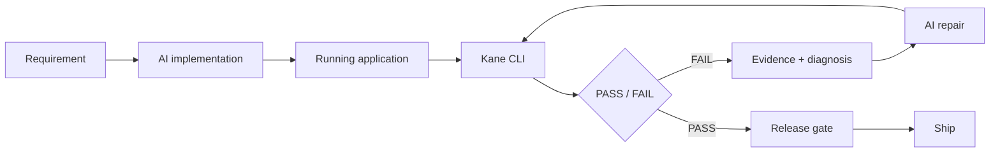

# ProofLoop

> **AI builds. Kane verifies. Evidence decides.**

ProofLoop is an evidence-based release gate for AI-built software. It pairs a small real web application with requirement-level browser verification so a release is based on observable behavior rather than an agent saying "done".

## The problem

AI coding agents can produce working-looking code quickly, but a generated application can still fail in the browser. ProofLoop makes verification a first-class release decision.

## The intended loop



## What's in this repository

### ProofBoard
A deterministic mini project/task application used as the browser verification target.

Requirements:

1. Create project
2. Add task
3. Complete task
4. Delete task
5. Dashboard state remains consistent

### ProofLoop control center
The UI presents:

- requirement status,
- release gate state,
- verification history,
- evidence ledger,
- repair-loop visualization.

The demo includes a controlled failure path so the failure → repair → re-verification narrative can be demonstrated safely.

### Kane test definitions
Kane CLI test definitions live under `.testmuai/tests/`. They are written using Kane's `test.md` format and target the local ProofBoard application.

**Important:** the repository does not fabricate Kane results. Genuine Kane evidence is created only when the tests are executed with an authenticated Kane CLI session.

## Local development

Requires Node.js 18+.

```bash
npm install
npm run dev
```

Open `http://127.0.0.1:5173/`.

Production build:

```bash
npm run build
npm run preview
```

## Kane CLI

Install the current Kane CLI according to the official documentation:

```bash
npm install -g @testmuai/kane-cli
kane-cli --version
```

Authenticate Kane in your local environment, then start ProofLoop and run:

```bash
kane-cli testmd run .testmuai/tests/proofboard_release_test.md
```

Review the generated result/evidence output before treating the run as verified.

## Architecture

```text
Requirement
    |
    v
ProofBoard application
    |
    v
Kane CLI browser verification
    |
    +---- PASS ----> Evidence ----> Release approved
    |
    +---- FAIL ----> Evidence ----> AI repair ----> Kane re-verification
```

## Project structure

```text
ProofLoop/
├── src/
│   ├── main.tsx
│   └── styles.css
├── .testmuai/tests/
│   └── proofboard_release_test.md
├── .env.example
├── HACKATHON_REQUIREMENTS.md
├── index.html
├── package.json
├── tsconfig*.json
└── vite.config.ts
```

## Security

No Kane credentials are stored in this repository. Kane authentication is managed by the CLI's local credential store. Do not commit `.env` files or browser/session credentials.

## Hackathon status

This repository is the implementation workspace. External eligibility, deadline, and submission facts must be verified against the current official hackathon rules before submission.

## Demo thesis

**AI builds. Kane verifies. Evidence decides.**
